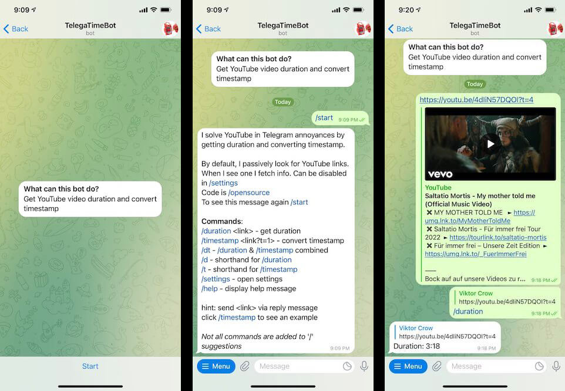

# TelegaTimeBot

Solves YouTube in Telegram annoyances by getting video duration and converting timestamp.

Add: <https://t.me/telegatimebot>

## In use

### Commands video

<./readme_assets/show-commands.mp4>

### Commands list

> `/start` - star the bot

> I solve YouTube in Telegram annoyances
> by getting duration and converting timestamp.
>
> By default, I passively look for YouTube links.
> When I see one I fetch info. Can be disabled in `/settings`
> Code is `/opensource`
> To see this message again `/start`
>
> **Commands**:
> `/duration` \<link\> - get duration
> `/timestamp` \<link?t=1\> - convert timestamp
> `/dt` - `/duration` :& `/timestamp` combined
> `/d` - shorthand for `/duration`\
> `/t` - shorthand for `/timestamp`\
> `/settings` - open settings
> `/help` - display help message
>
> hint: send \<link\> via reply message
> click /timestamp to see an example
>
> _Not all commands are added to_ '/' _suggestions_ or bot menu`;

## Other

Q: What is "telega"?
A: In Russian language "telega" means a wagon.
In Russian web slang it used for Telegram
e.g.: "She messaged me in telega"
